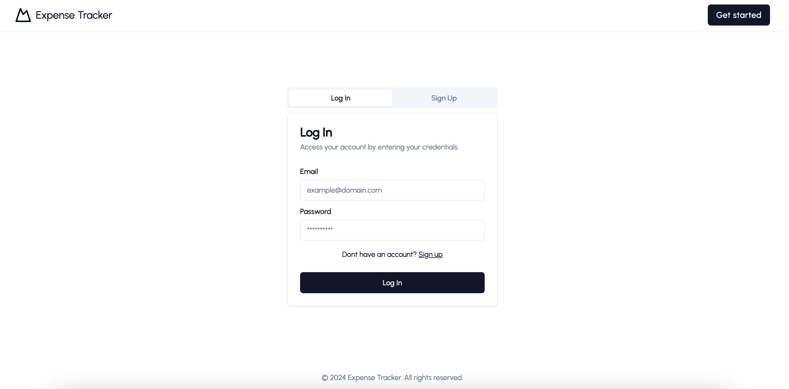
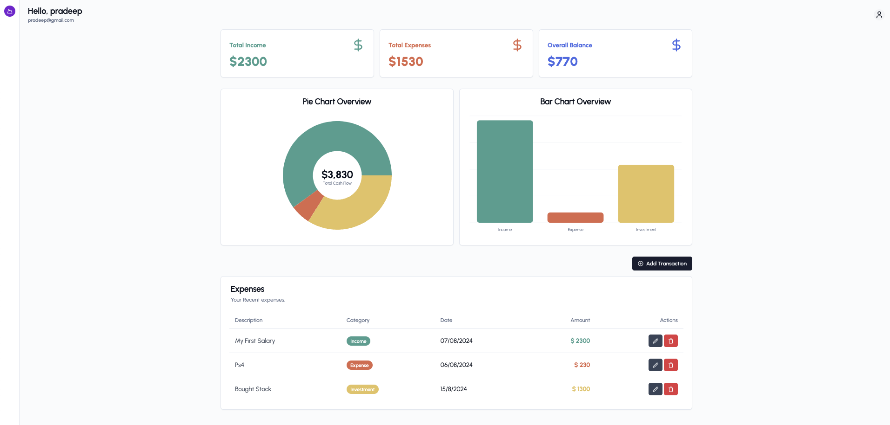
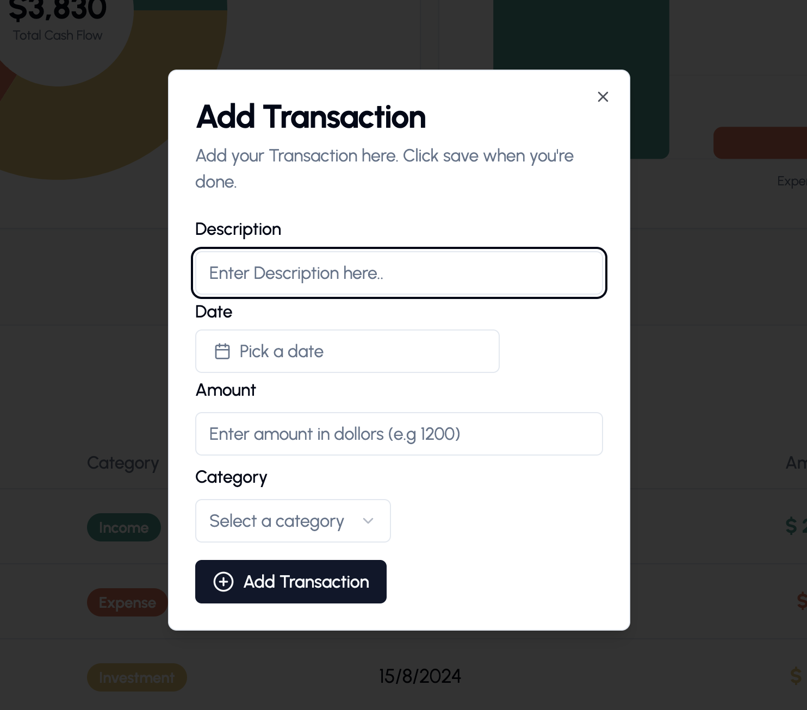
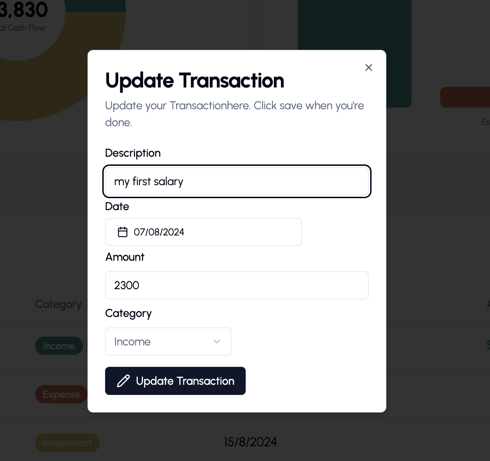
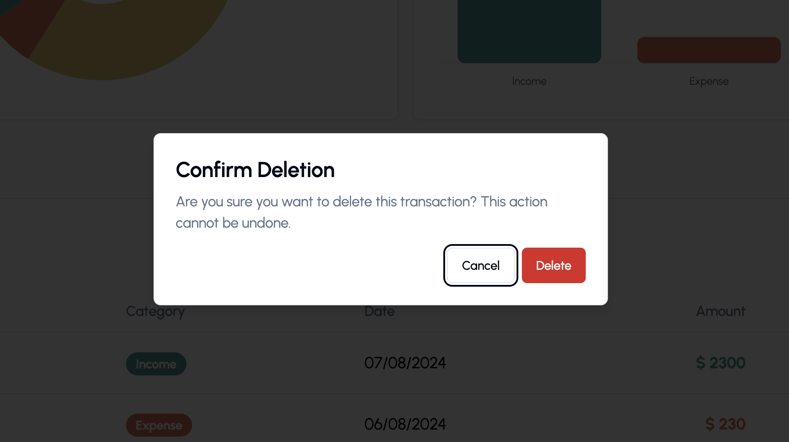

# Expense Tracker

## Overview

Welcome to the Expense Tracker, a powerful, user-friendly web application designed to help you manage your finances effectively. Built with the MERN stack and utilizing GraphQL for seamless data management, this app provides an intuitive interface to track your expenses, set budgets, and gain insights into your spending habits.

## Live Demo

Check out the live version of the app here: [Expense Tracker Live Demo.](https://expense-tracker-6krc.onrender.com/)

## Screenshots

### Landing Page

_Description: Landing page of the application._

### Auth Page

_Description: login/signup page of the application._

### Dashboard

_Description: Main dashboard page once the user is logged in._

### Add Expense

_Description: add expense modal._

### Update Expense

_Description: update expense modal._

### Delete Expense

_Description: delete expense modal._

## Features

- **Expense Management**: Easily add,edit and delete expenses.
- **Budget Tracking**: Set budgets for different categories and track your spending against them.
- **Data Visualization**: Visualize your expenses with dynamic charts.
- **User Authentication**: Secure login and signup system using jwt.
- **Responsive Design**: Fully responsive UI built with Shadcn and Tailwind CSS, ensuring a seamless experience on all devices.

## Tech Stack

### Frontend

- **React(with Vite)**: A modern JavaScript library for building user interfaces.
- **Shadcn UI Library**: A customizable and accessible UI library for React.
- **Tailwind CSS**: Used for additional UI components and layouts.

### Backend

- **Node**: JavaScript runtime built on Chrome's V8 JavaScript engine.
- **Express.js**: Fast, unopinionated, minimalist web framework for Node.js
- **Graph QL**: A query language for your API, enabling declarative data fetching.
- **MongoDB**: A query language for your API, enabling declarative data fetching.
- **Mongoose**: Elegant MongoDB object modeling for Node.js.

## Deployment

- **Render**: Deployed on Render for scalable and reliable hosting.

## Usage

Once the app is running, you can:

1.  **Sign Up/ Log In**: Create a new account or log in with existing credentials.
2.  **Manage Exoenses**:Add, edit, or delete expenses from your dashboard.
3.  **Data Overview**: Analyze your spending habits with detailed table and charts.

If you have any questions, feel free to reach out:

- **GitHub**: [pradeepkhanal23](https://github.com/pradeepkhanal23)
- **Email**: [pradeepkhanal642@gmail.com](mailto:pradeepkhanal642@gmail.com)
